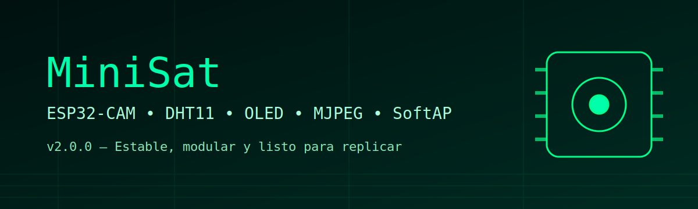

# 🛰️ MiniSat – Versión 2.0.0 (2026)

MiniSat es un sistema compacto de telemetría con cámara basado en el módulo **AI Thinker ESP32‑CAM**, diseñado para funcionar sin necesidad de WiFi externo mediante un **SoftAP propio** y un **dashboard web en tiempo real**.

Esta es la **versión 2.0.0**, completamente reestructurada para máxima estabilidad, modularidad y facilidad de pruebas.

---

# ✨ Características

- 📡 SoftAP independiente (SSID: MiniSat)
- 📷 Streaming MJPEG estable (`/stream`)
- 🌡️ Sensor DHT11 (temperatura y humedad)
- 🖥️ OLED SSD1306 128x64 (I2C)
- 📊 Dashboard web sin recarga (`/`)
- 🔄 Telemetría JSON (`/data`)
- ⚡ Optimizaciones contra brownout y reinicios
- 🧩 Arquitectura por fases para diagnosticar fallas
- 🧪 Ejemplos individuales incluidos en `examples/`

---

# 📂 Estructura del repositorio

  

